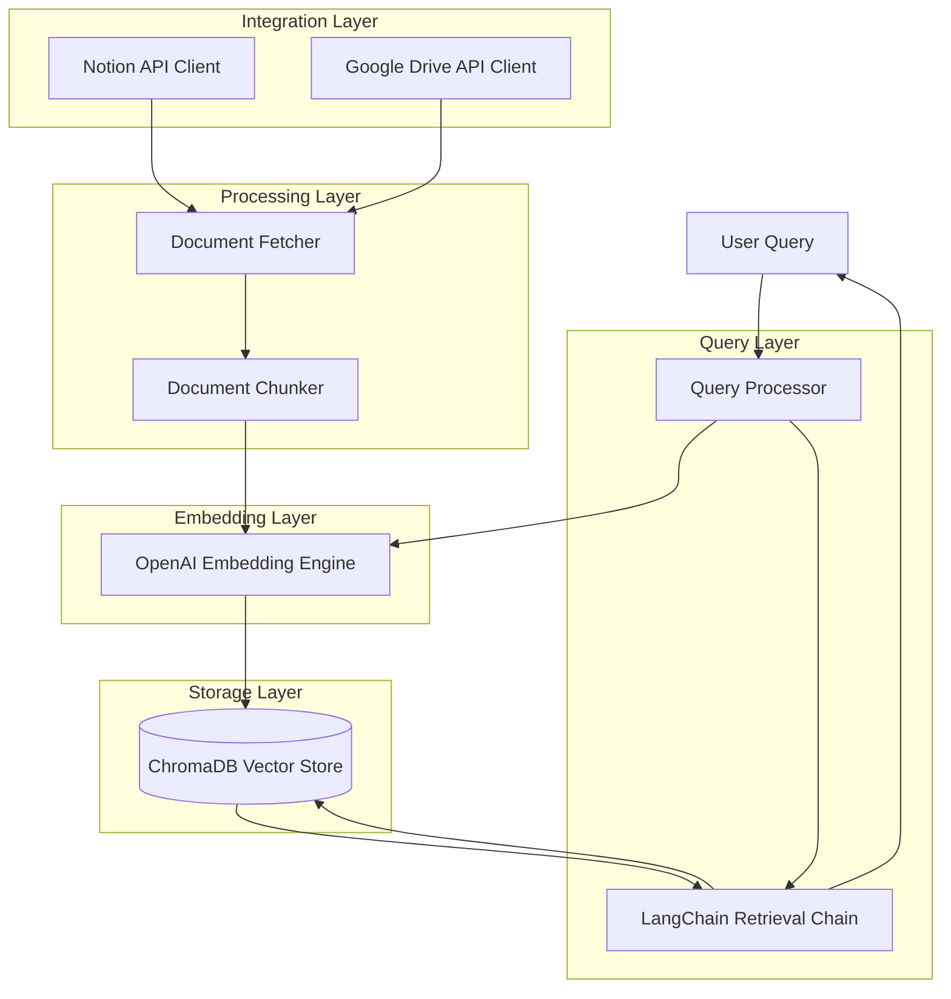

# Design Document: AI-Powered Document Search

## Overview

The AI-powered document search system is a semantic search application that enables users to query their Notion and Google Drive documents using natural language. The system leverages OpenAI embeddings to convert documents into vector representations, stores them in ChromaDB for efficient retrieval, and uses LangChain to orchestrate intelligent query processing and result synthesis.

The architecture follows a pipeline pattern: documents are fetched from external sources, chunked and embedded, stored in a vector database, and then retrieved based on semantic similarity to user queries. LangChain provides the orchestration layer that ties these components together into cohesive retrieval chains.

## Architecture

The system consists of five main layers:

1. **Integration Layer**: Handles authentication and communication with Notion API and Google Drive API
2. **Processing Layer**: Manages document fetching, chunking, and preprocessing
3. **Embedding Layer**: Generates vector embeddings using OpenAI's API
4. **Storage Layer**: Manages ChromaDB for vector storage and retrieval
5. **Query Layer**: Processes user queries and orchestrates retrieval using LangChain



## Components and Interfaces

### 1. Document Source Connectors

**NotionConnector**
```python
class NotionConnector:
    def __init__(self, api_key: str, workspace_id: str):
        """Initialize Notion API client with credentials"""
        
    def authenticate(self) -> bool:
        """Authenticate with Notion API and verify access"""
        
    def fetch_documents(self) -> List[Document]:
        """Fetch all accessible documents from Notion workspace"""
        
    def fetch_document_by_id(self, doc_id: str) -> Document:
        """Fetch a specific document by ID"""
        
    def get_document_metadata(self, doc_id: str) -> DocumentMetadata:
        """Retrieve metadata for a document"""
```

**GoogleDriveConnector**
```python
class GoogleDriveConnector:
    def __init__(self, credentials_path: str):
        """Initialize Google Drive API client with OAuth credentials"""
        
    def authenticate(self) -> bool:
        """Authenticate with Google Drive API and verify access"""
        
    def fetch_documents(self, folder_id: Optional[str] = None) -> List[Document]:
        """Fetch documents from Google Drive, optionally filtered by folder"""
        
    def fetch_document_by_id(self, doc_id: str) -> Document:
        """Fetch a specific document by ID"""
        
    def get_document_metadata(self, doc_id: str) -> DocumentMetadata:
        """Retrieve metadata for a document"""
```

### 2. Document Processing Components

**DocumentChunker**
```python
class DocumentChunker:
    def __init__(self, chunk_size: int = 1000, overlap: int = 200):
        """Initialize chunker with size and overlap parameters"""
        
    def chunk_document(self, document: Document) -> List[DocumentChunk]:
        """Split document into chunks while preserving context"""
        
    def _split_on_boundaries(self, text: str) -> List[str]:
        """Split text on paragraph/sentence boundaries"""
```

**DocumentFetcher**
```python
class DocumentFetcher:
    def __init__(self, connectors: List[Union[NotionConnector, GoogleDriveConnector]]):
        """Initialize with one or more document source connectors"""
        
    def fetch_all_documents(self) -> List[Document]:
        """Fetch documents from all configured sources"""
        
    def detect_changes(self, last_sync: datetime) -> List[Document]:
        """Detect documents modified since last sync"""
```

### 3. Embedding Engine

**EmbeddingEngine**
```python
class EmbeddingEngine:
    def __init__(self, api_key: str, model: str = "text-embedding-ada-002"):
        """Initialize OpenAI embedding engine"""
        
    def generate_embedding(self, text: str) -> List[float]:
        """Generate embedding vector for text"""
        
    def generate_embeddings_batch(self, texts: List[str]) -> List[List[float]]:
        """Generate embeddings for multiple texts efficiently"""
        
    def _retry_with_backoff(self, func, max_retries: int = 3):
        """Retry failed API calls with exponential backoff"""
```

### 4. Vector Store

**VectorStore**
```python
class VectorStore:
    def __init__(self, collection_name: str, persist_directory: str):
        """Initialize ChromaDB vector store"""
        
    def add_documents(self, chunks: List[DocumentChunk], embeddings: List[List[float]]):
        """Store document chunks with their embeddings"""
        
    def similarity_search(self, query_embedding: List[float], k: int = 5, 
                         threshold: float = 0.7) -> List[SearchResult]:
        """Perform similarity search and return top k results above threshold"""
        
    def update_document(self, doc_id: str, chunks: List[DocumentChunk], 
                       embeddings: List[List[float]]):
        """Update embeddings for a modified document"""
        
    def delete_document(self, doc_id: str):
        """Remove all chunks for a document"""
        
    def check_duplicate(self, doc_id: str) -> bool:
        """Check if document already exists in store"""
```

### 5. Query Processing

**QueryProcessor**
```python
class QueryProcessor:
    def __init__(self, embedding_engine: EmbeddingEngine, vector_store: VectorStore):
        """Initialize query processor with embedding engine and vector store"""
        
    def process_query(self, query: str, max_results: int = 5) -> List[SearchResult]:
        """Process natural language query and return results"""
        
    def validate_query(self, query: str) -> bool:
        """Validate query is non-empty and meaningful"""
        
    def _generate_query_embedding(self, query: str) -> List[float]:
        """Generate embedding for user query"""
```

**RetrievalChain**
```python
class RetrievalChain:
    def __init__(self, query_processor: QueryProcessor, llm_model: str = "gpt-3.5-turbo"):
        """Initialize LangChain retrieval chain"""
        
    def retrieve_and_synthesize(self, query: str) -> str:
        """Retrieve relevant chunks and synthesize answer"""
        
    def reformulate_query(self, query: str) -> str:
        """Use LLM to reformulate unclear queries"""
        
    def break_into_subqueries(self, query: str) -> List[str]:
        """Break complex queries into simpler sub-queries"""
        
    def rank_results(self, results: List[SearchResult]) -> List[SearchResult]:
        """Re-rank results considering relevance and recency"""
```

## Data Models

### Document
```python
@dataclass
class Document:
    id: str
    source: str  # "notion" or "google_drive"
    title: str
    content: str
    metadata: DocumentMetadata
    
@dataclass
class DocumentMetadata:
    author: str
    created_at: datetime
    modified_at: datetime
    url: str
    permissions: List[str]
```

### DocumentChunk
```python
@dataclass
class DocumentChunk:
    id: str
    document_id: str
    content: str
    chunk_index: int
    metadata: DocumentMetadata
```

### SearchResult
```python
@dataclass
class SearchResult:
    chunk: DocumentChunk
    relevance_score: float
    source_document: str
    
    def __lt__(self, other):
        """Compare by relevance score, then by recency"""
        if abs(self.relevance_score - other.relevance_score) < 0.01:
            return self.chunk.metadata.modified_at > other.chunk.metadata.modified_at
        return self.relevance_score > other.relevance_score
```

### Configuration
```python
@dataclass
class SearchConfig:
    notion_api_key: Optional[str]
    notion_workspace_id: Optional[str]
    google_credentials_path: Optional[str]
    openai_api_key: str
    chroma_persist_dir: str
    chunk_size: int = 1000
    chunk_overlap: int = 200
    default_result_limit: int = 5
    similarity_threshold: float = 0.7
    max_results: int = 20
```


## Correctness Properties

*A property is a characteristic or behavior that should hold true across all valid executions of a system—essentially, a formal statement about what the system should do. Properties serve as the bridge between human-readable specifications and machine-verifiable correctness guarantees.*

### Authentication and Connection Properties

**Property 1: Valid credentials enable authentication**
*For any* valid API credentials (Notion or Google Drive), authentication should succeed and establish a connection to the respective service.
**Validates: Requirements 1.1, 1.2**

**Property 2: Invalid credentials produce descriptive errors**
*For any* invalid or malformed API credentials, the authentication attempt should fail and return an error message that describes the specific failure reason.
**Validates: Requirements 1.3**

**Property 3: Permission verification precedes operations**
*For any* successfully established connection, access permissions must be verified before any document operations are performed.
**Validates: Requirements 1.4**

**Property 4: Multi-source search aggregation**
*For any* search query when both Notion and Google Drive are configured, results should include documents from both sources.
**Validates: Requirements 1.5**

### Document Processing Properties

**Property 5: Complete document retrieval**
*For any* connected document source, all accessible documents should be fetched without omission.
**Validates: Requirements 2.1**

**Property 6: Metadata preservation**
*For any* document fetched from a source, the extracted document should contain all required metadata fields (title, author, created_at, modified_at).
**Validates: Requirements 2.2**

**Property 7: Document chunking completeness**
*For any* document, splitting it into chunks and concatenating those chunks should reconstruct the original document content.
**Validates: Requirements 2.3**

**Property 8: Chunk boundary integrity**
*For any* document that is chunked, no chunk boundary should occur in the middle of a sentence (all boundaries should be at sentence or paragraph boundaries).
**Validates: Requirements 2.4**

**Property 9: Partial failure resilience**
*For any* batch of documents where some fail to fetch, the system should continue processing the remaining documents and log errors for the failed ones.
**Validates: Requirements 2.5**

**Property 10: Change detection and re-processing**
*For any* document that is modified in the source after initial processing, the system should detect the change and re-process the document.
**Validates: Requirements 2.6**

### Embedding and Storage Properties

**Property 11: Embedding generation for all chunks**
*For any* document chunk, an embedding vector should be successfully generated.
**Validates: Requirements 3.1**

**Property 12: Storage round-trip consistency**
*For any* document chunk that is embedded and stored, retrieving it from the vector store should return the original text content and all metadata.
**Validates: Requirements 3.2**

**Property 13: Retry logic with exponential backoff**
*For any* operation that fails due to transient errors (API failures, network errors), the system should retry exactly 3 times with exponentially increasing delays before giving up.
**Validates: Requirements 3.4, 7.4**

**Property 14: Duplicate document idempotence**
*For any* document, processing it multiple times should result in only one set of embeddings in the vector store (updates, not duplicates).
**Validates: Requirements 3.6**

### Query Processing Properties

**Property 15: Query length validation**
*For any* query string, it should be accepted if and only if its length is between 1 and 500 characters (inclusive).
**Validates: Requirements 4.1**

**Property 16: Query embedding generation**
*For any* valid query string, an embedding vector should be successfully generated using the same embedding engine as document chunks.
**Validates: Requirements 4.2**

**Property 17: Empty query rejection**
*For any* string that is empty or contains only whitespace characters, submitting it as a query should return an error message.
**Validates: Requirements 4.4**

### Search and Retrieval Properties

**Property 18: Similarity search execution**
*For any* query embedding, a similarity search should be performed against the vector store.
**Validates: Requirements 5.1**

**Property 19: Default result limit**
*For any* query where no result limit is specified, the system should return at most 5 results (or fewer if less than 5 relevant results exist).
**Validates: Requirements 5.2**

**Property 20: Recency-based tie-breaking**
*For any* set of search results where multiple results have similarity scores within 0.01 of each other, those results should be ordered by modification date (most recent first).
**Validates: Requirements 5.3**

**Property 21: Result completeness**
*For any* search result returned, it should include the original text content, all source document metadata, and a relevance score.
**Validates: Requirements 5.4**

**Property 22: Custom result limit enforcement**
*For any* query with a specified result limit N (where 1 ≤ N ≤ 20), the system should return at most N results.
**Validates: Requirements 5.6**

### Configuration Properties

**Property 23: Configuration file loading**
*For any* valid configuration file, the system should successfully load and apply all configuration parameters.
**Validates: Requirements 6.5**

### Error Handling Properties

**Property 24: Rate limit backoff**
*For any* API operation that encounters a rate limit error, the system should implement exponential backoff before retrying.
**Validates: Requirements 7.1**

**Property 25: Request queuing during outages**
*For any* embedding request made while the embedding engine is unavailable, the request should be queued and processed once the service is restored.
**Validates: Requirements 7.2**

**Property 26: Service unavailability errors**
*For any* query attempt when the vector store is unavailable, the system should return an error message indicating temporary unavailability.
**Validates: Requirements 7.3**

**Property 27: Error logging completeness**
*For any* error that occurs during system operation, a log entry should be created containing sufficient detail for debugging (error type, context, timestamp).
**Validates: Requirements 7.5**

### Security Properties

**Property 28: Credential encryption at rest**
*For any* API credentials stored by the system, they should be encrypted and not readable in plain text from storage.
**Validates: Requirements 9.1**

**Property 29: HTTPS for external communication**
*For any* API call to external services (Notion, Google Drive, OpenAI), the connection should use HTTPS protocol.
**Validates: Requirements 9.2**

**Property 30: Permission preservation**
*For any* document with access permissions in the source system, those permissions should be preserved and enforced when accessing embeddings.
**Validates: Requirements 9.3**

**Property 31: Access revocation propagation**
*For any* user whose access is revoked in the source system, their access to corresponding embeddings should be removed.
**Validates: Requirements 9.4**

**Property 32: Content confidentiality**
*For any* document processed by the system, its content should not appear in plain text in log files or any storage outside the vector store.
**Validates: Requirements 9.5**

## Error Handling

The system implements comprehensive error handling across all layers:

### API Integration Errors
- **Authentication failures**: Return descriptive error messages indicating the specific authentication issue (invalid credentials, expired tokens, insufficient permissions)
- **Rate limiting**: Implement exponential backoff with jitter (initial delay: 1s, max delay: 60s)
- **Network timeouts**: Retry up to 3 times with exponential backoff before failing
- **Service unavailability**: Queue requests for embedding engine; return immediate error for vector store

### Processing Errors
- **Document fetch failures**: Log error with document ID and continue processing remaining documents
- **Chunking errors**: Log error and skip problematic document
- **Embedding generation failures**: Retry with exponential backoff; if all retries fail, log error and skip chunk

### Query Errors
- **Invalid query format**: Return validation error with specific issue (empty, too long, invalid characters)
- **No results found**: Return empty result set with message indicating no relevant documents found
- **Vector store unavailable**: Return service unavailable error with retry suggestion

### Storage Errors
- **Capacity exceeded**: Return error indicating storage limit reached with guidance on cleanup
- **Duplicate detection**: Update existing embeddings instead of creating duplicates
- **Corruption detection**: Log error and attempt recovery; if recovery fails, mark document for re-processing

### Error Logging
All errors are logged with:
- Timestamp
- Error type and message
- Context (operation being performed, document/query ID)
- Stack trace for unexpected errors
- User ID (if applicable)

## Testing Strategy

The testing strategy employs a dual approach combining unit tests for specific scenarios and property-based tests for universal correctness guarantees.

### Property-Based Testing

Property-based testing will be implemented using **Hypothesis** (for Python), which generates random test inputs to verify that properties hold across a wide range of scenarios.

**Configuration:**
- Minimum 100 iterations per property test
- Each test tagged with format: **Feature: ai-document-search, Property N: [property description]**
- Custom generators for domain objects (Documents, Chunks, Queries, Credentials)

**Property Test Coverage:**
- Authentication and connection properties (Properties 1-4)
- Document processing properties (Properties 5-10)
- Embedding and storage properties (Properties 11-14)
- Query processing properties (Properties 15-17)
- Search and retrieval properties (Properties 18-22)
- Configuration properties (Property 23)
- Error handling properties (Properties 24-27)
- Security properties (Properties 28-32)

**Example Property Test Structure:**
```python
from hypothesis import given, strategies as st

@given(st.text(min_size=1, max_size=500))
def test_property_15_query_length_validation(query):
    """Feature: ai-document-search, Property 15: Query length validation"""
    processor = QueryProcessor(embedding_engine, vector_store)
    result = processor.validate_query(query)
    assert result == True  # Should accept queries 1-500 chars

@given(st.text(min_size=501))
def test_property_15_query_too_long(query):
    """Feature: ai-document-search, Property 15: Query length validation"""
    processor = QueryProcessor(embedding_engine, vector_store)
    with pytest.raises(ValidationError):
        processor.process_query(query)
```

### Unit Testing

Unit tests complement property tests by focusing on:

**Specific Examples:**
- Successful authentication with known valid credentials
- Document chunking with sample documents of various sizes
- Search with known query-document pairs

**Edge Cases:**
- Empty document handling
- Documents with special characters or non-English text
- Queries at exactly 500 characters
- Vector store at capacity
- No search results (all scores below threshold)

**Integration Points:**
- Notion API integration with mock responses
- Google Drive API integration with mock responses
- OpenAI API integration with mock embeddings
- ChromaDB operations with test database

**Error Conditions:**
- Network failures during API calls
- Malformed API responses
- Database connection failures
- Invalid configuration files

**Test Organization:**
```
tests/
├── unit/
│   ├── test_connectors.py
│   ├── test_document_processing.py
│   ├── test_embedding_engine.py
│   ├── test_vector_store.py
│   └── test_query_processing.py
├── property/
│   ├── test_authentication_properties.py
│   ├── test_processing_properties.py
│   ├── test_embedding_properties.py
│   ├── test_query_properties.py
│   └── test_security_properties.py
├── integration/
│   ├── test_end_to_end_search.py
│   ├── test_multi_source_search.py
│   └── test_document_updates.py
└── fixtures/
    ├── sample_documents.py
    ├── mock_api_responses.py
    └── test_configurations.py
```

### Testing Best Practices

**Balance:**
- Use property tests to verify universal correctness across many inputs
- Use unit tests for specific examples, edge cases, and integration points
- Avoid writing too many unit tests for scenarios already covered by properties

**Mocking:**
- Mock external API calls (Notion, Google Drive, OpenAI) to avoid rate limits and costs
- Use test ChromaDB instance with in-memory storage for fast tests
- Provide realistic mock responses based on actual API documentation

**Test Data:**
- Generate diverse test documents (various lengths, formats, languages)
- Include edge cases in test fixtures (empty documents, very long documents, special characters)
- Use anonymized real-world examples where appropriate

**Continuous Integration:**
- Run unit tests on every commit
- Run property tests with reduced iterations (50) on every commit
- Run full property tests (100+ iterations) nightly
- Run integration tests before releases
